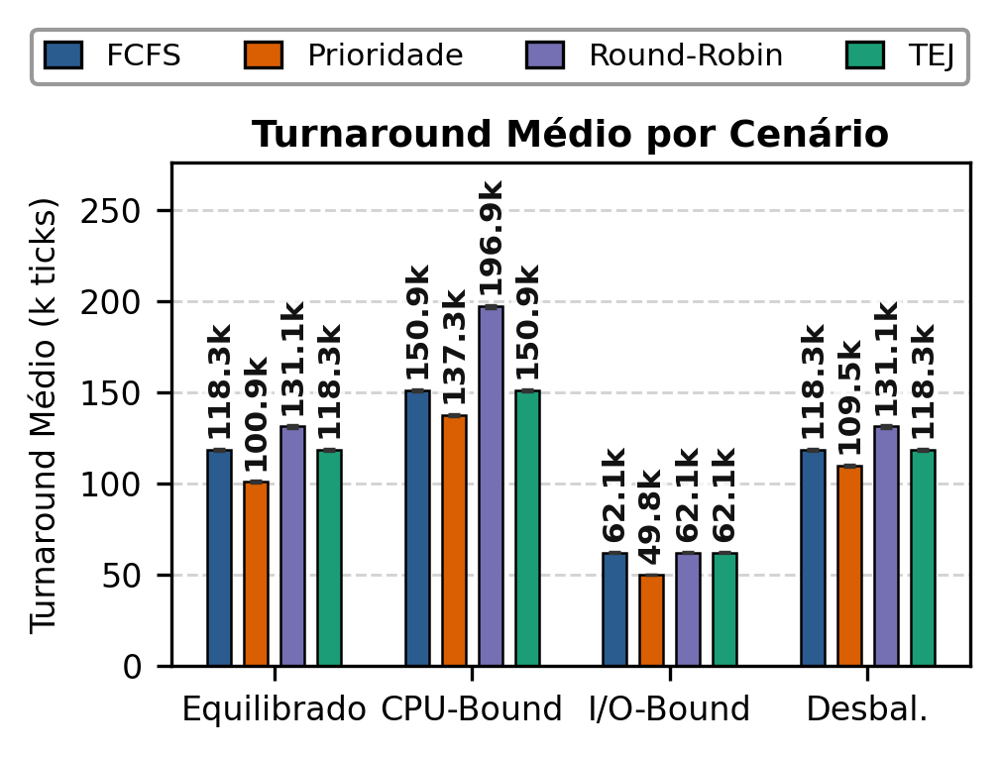
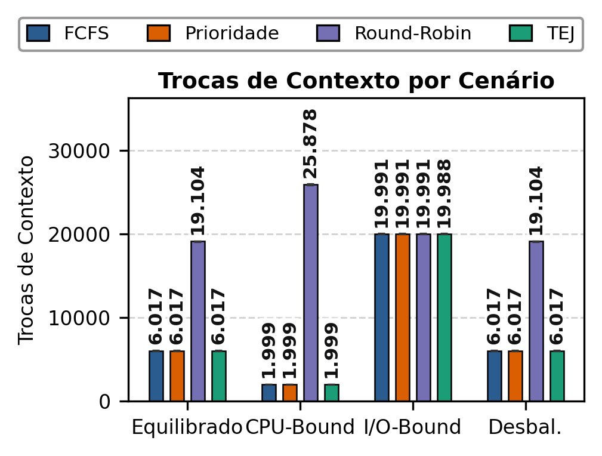
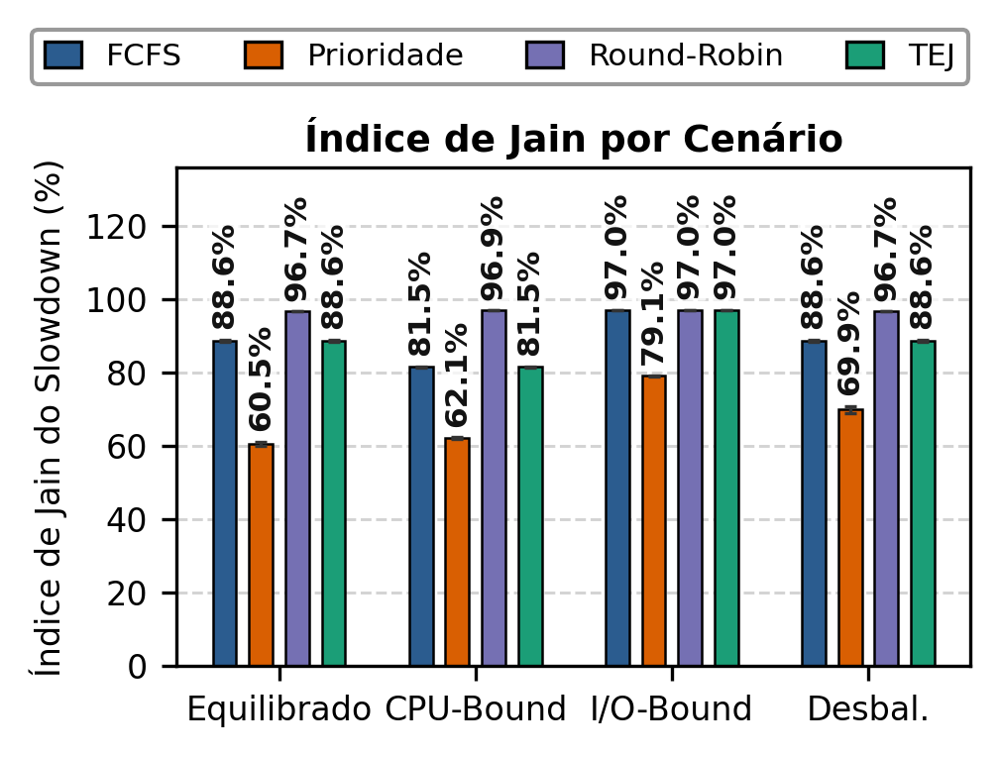

# SimuSched

[](https://en.wikipedia.org/wiki/C_(programming_language))
[](https://github.com/LeoncioFerreira/SimuSched/actions/workflows/ci.yml)
[](LICENSE)

## 1. Nossa Equipe

| Integrante | GitHub |
| --- | --- |
| André Wesley Barbosa Rodrigues Filho | [@awesleyy](https://github.com/awesleyy) |
| Leôncio Ferreira Flores Neto | [@LeoncioFerreira](https://github.com/LeoncioFerreira) |
| Paulo Gabriel Leite Landim | [@LandimPG](https://github.com/LandimPG) |
| Salomão Rodrigues Silva | [@salomaosilvaa](https://github.com/salomaosilvaa) |

## 2. O Projeto

O SimuSched é um simulador determinístico de escalonamento de processos, desenvolvido em C para a disciplina de Sistemas Operacionais da UFCA. O projeto compara FCFS, Prioridade não preemptiva e Round-Robin com o algoritmo próprio **Triagem com Espera Justa (TEJ)**.

O problema central é a inanição (*starvation*): processos de baixa prioridade podem esperar indefinidamente quando tarefas de alta prioridade continuam chegando. O TEJ combina prioridade estática com um prazo determinístico de resgate. Quando o prazo é atingido, o processo recebe precedência na próxima decisão, sem interromper a rajada que já está usando a CPU.

## 3. Demonstração e Resultados

Os resultados usam a mesma carga para todos os algoritmos em quatro cenários obrigatórios: equilibrado, CPU-bound, I/O-bound e prioridades desbalanceadas. A campanha possui 1.600 execuções — 4 algoritmos × 4 cenários × 100 seeds — com 1.000 processos por execução e IC95% calculado pela distribuição t de Student.

As métricas avaliadas são:

- **Turnaround médio:** tempo entre chegada e conclusão;
- **Trocas de contexto:** mudanças de processo na CPU;
- **Índice de Jain do slowdown:** equilíbrio entre os atrasos relativos.

Os materiais para consulta são o [artigo científico](docs/report/artigo_so.pdf), os [slides da apresentação](docs/slides/slide_sistemas_operacionais_TEJ.pdf) e as [figuras do relatório](docs/report/figuras/).

## 4. Como Rodar Localmente

### Pré-requisitos

- GCC ou compilador compatível com C;
- GNU Make;
- Python 3;
- `cppcheck` e `clang-format` para os alvos de qualidade.

### Compilar e testar

```bash
make all
make test
```

### Executar uma simulação

```bash
./bin/simulador \
  --algorithm tej \
  --seed 42 \
  --config configs/small.conf \
  --output data/raw/tej-small-42.csv
```

Os algoritmos aceitos são `fcfs`, `priority`, `round-robin` e `tej`. Para uma comparação justa, mantenha o mesmo cenário e a mesma seed e altere apenas `--algorithm`.

### Executar e consolidar a campanha

```bash
make run-all
make stats
make figures
```

Os resultados brutos são gravados em `data/raw/simulations.csv`; as tabelas consolidadas ficam em `data/processed/` e as figuras em `results/figures/` e `docs/report/figuras/`.

### Gráficos principais







Outros alvos disponíveis são `make test-stats`, `make lint`, `make format` e `make clean`.

## 5. Como o Simulador Funciona

A simulação usa tempo discreto em ticks. Cada processo possui identificador, chegada, prioridade, estado e uma sequência de rajadas `CPU → E/S → CPU`. Os estados são `NEW`, `READY`, `RUNNING`, `BLOCKED` e `FINISHED`.

- Apenas um processo executa por vez;
- operações de E/S são paralelas, sem fila única de dispositivo;
- ao concluir E/S, o processo retorna ao final da fila `READY`;
- o custo de troca deixa a CPU indisponível durante os ticks configurados;
- a saída do estado ocioso não conta como troca;
- prioridades menores representam maior prioridade (`0` é a máxima).

### Algoritmos

- **FCFS:** seleciona pela ordem de entrada na fila;
- **Prioridade:** seleciona a menor prioridade numérica, sem preempção;
- **Round-Robin:** usa quantum configurável de 10 ticks e preempção ao fim do quantum;
- **TEJ:** usa prioridade normalmente e dá precedência a processos cujo prazo de resgate foi atingido.

O prazo do TEJ é calculado por:

```text
rescue_deadline = ready_queue_arrival
                  + (priority - minimum_priority + 1) * rescue_interval
```

Com `rescue_interval = 10`, o TEJ seleciona primeiro os processos resgatados. Empates usam prazo, entrada mais antiga na fila e menor identificador. A política é não preemptiva.

## 6. Cenários e Reprodutibilidade

Os cenários estão em [`configs/`](configs/):

- `balanced.conf`: mistura de rajadas de CPU e E/S;
- `cpu_bound.conf`: CPU entre 50 e 200 ticks e pouca E/S;
- `io_bound.conf`: CPU entre 1 e 5 ticks, E/S entre 30 e 100 ticks e muitas requisições;
- `unbalanced_priorities.conf`: 85% dos processos com prioridade 0 e 15% com prioridade 10.

As chegadas são sorteadas uniformemente no intervalo `[0, 5000]` a partir da seed. A mesma seed e o mesmo cenário produzem a mesma carga em qualquer algoritmo. As 100 seeds estão em [`configs/seeds.txt`](configs/seeds.txt).

## 7. Issues e Entregas

O TEJ foi projetado e desenvolvido em conjunto pela equipe. As demais responsabilidades foram conferidas nas issues reais e no histórico de commits.

| Integrante | Issues associadas | Entregas e responsabilidades |
| --- | --- | --- |
| André Wesley Barbosa Rodrigues Filho | [#4](https://github.com/LeoncioFerreira/SimuSched/issues/4), [#12](https://github.com/LeoncioFerreira/SimuSched/issues/12), [#20](https://github.com/LeoncioFerreira/SimuSched/issues/20) | CLI, CSV, métricas, consolidação estatística e testes de IC95% |
| Leôncio Ferreira Flores Neto | [#1](https://github.com/LeoncioFerreira/SimuSched/issues/1), [#9](https://github.com/LeoncioFerreira/SimuSched/issues/9), [#18](https://github.com/LeoncioFerreira/SimuSched/issues/18), [#19](https://github.com/LeoncioFerreira/SimuSched/issues/19), [#22](https://github.com/LeoncioFerreira/SimuSched/issues/22) | Núcleo, Round-Robin, TEJ, executor da campanha e coordenação do artigo |
| Paulo Gabriel Leite Landim | [#2](https://github.com/LeoncioFerreira/SimuSched/issues/2), [#11](https://github.com/LeoncioFerreira/SimuSched/issues/11), [#21](https://github.com/LeoncioFerreira/SimuSched/issues/21), [#23](https://github.com/LeoncioFerreira/SimuSched/issues/23) | FCFS, prioridade, cenários, gráficos comparativos e slides |
| Salomão Rodrigues Silva | [#3](https://github.com/LeoncioFerreira/SimuSched/issues/3), [#10](https://github.com/LeoncioFerreira/SimuSched/issues/10), [#23](https://github.com/LeoncioFerreira/SimuSched/issues/23) | Gerador determinístico, E/S, custo de troca, resultados da campanha e slides |

## 8. Estrutura do Projeto

```text
.
├── configs/                  # Cenários e seeds
├── data/                     # Dados brutos e tabelas geradas localmente
├── docs/                     # Artigo, slides e decisões de modelagem
├── include/                  # Interfaces públicas em C
├── results/figures/          # Gráficos gerados
├── scripts/                  # Campanha, estatística e visualização
├── src/                      # Código-fonte do simulador
└── tests/                    # Testes C, Python e Unity
```

## 9. Documentação e Licença

- [Artigo científico](docs/report/artigo_so.pdf);
- [Slides](docs/slides/slide_sistemas_operacionais_TEJ.pdf);
- [Figuras](docs/report/figuras/);
- [Scripts](scripts/);
- [Decisões de modelagem](docs/design/);
- [Issue de integração](https://github.com/LeoncioFerreira/SimuSched/issues/27).

O projeto é distribuído sob a [licença MIT](LICENSE).
